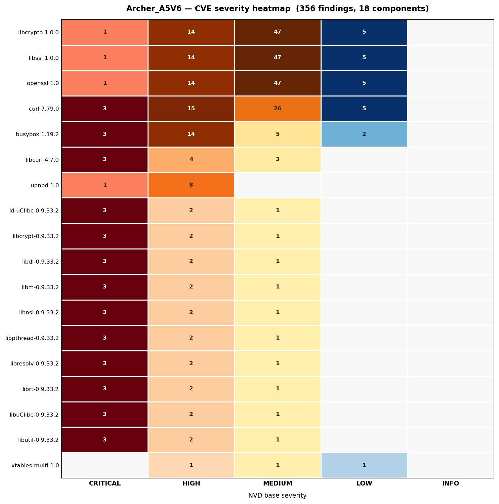

# Firmware Analysis Inspector

Static security analysis pipeline for router firmware images. Extracts firmware components inside Docker, runs 40+ security checks against the root filesystem, synthesizes an attack surface model, and builds a typed entity-relationship graph for attack path analysis.

Developed and tested against TP-Link Archer A5 V6 (`Archer_A5V6.bin`).

---

## Pipeline Overview

```
firmware.bin
    │
    ▼
[1] firmware_analysis/extraction/extract.py   ← orchestrates Docker build + run
    │
    ├─ carve.py                               ← binwalk scan → carve bootloader / kernel / rootfs
    └─ analyze.py                             ← 40+ checks against extracted rootfs
    │                                            Phase 4: generates sbom/sbom.cdx.json (CycloneDX 1.5)
    ▼
analysis/<firmware>/raw/                      ← raw findings (txt + json sidecars)
analysis/<firmware>/sbom/                     ← sbom.cdx.json
    │
    ▼
[2] firmware_analysis/surface/surface.py      ← synthesize structured attack surface model
    │
    ▼
analysis/<firmware>/attack_surface/attack_surface.json
    │
    ▼
[3] firmware_analysis/graph/graph.py          ← build typed entity-relationship graph
    │
    ▼
analysis/<firmware>/attack_surface/graph.json
analysis/<firmware>/attack_surface/graph.dot
    │
    ▼
[4] dot (graphviz)                            ← render DOT to SVG (optional, skipped if not installed)
    │
    ▼
analysis/<firmware>/attack_surface/graph.svg
    │
    ▼
[5] firmware_analysis/cve/cve.py              ← CVE enrichment (host-side, requires grype)
    │                                            cross-references CVEs with hardening flags
    │                                            and network reachability from graph.json
    ▼
analysis/<firmware>/sbom/cve_report.json
    │
    ▼
[6] firmware_analysis/reporting/heatmap.py    ← CVE severity heatmap (requires matplotlib)
    ▼
analysis/<firmware>/sbom/cve_heatmap.png
```

Each stage records `success | partial | failed | skipped` in `pipeline_manifest.json`. Downstream stages are automatically skipped when a dependency fails, preventing stale data from propagating.

---

## Requirements

- Docker
- Python 3.12+

No Python dependencies are required on the host. All extraction tooling runs inside the container.

---

## Usage

### Run the full pipeline (recommended)

```bash
python3 pipeline.py input/TP-Link/Archer_A5_v6.20/Archer_A5V6.bin
```

Runs all six stages in sequence and prints a summary at the end.

Options:

```
positional:
  firmware          Path to firmware binary

optional:
  --output, -o      Host directory for all output (default: ./analysis)
  --skip-build      Skip Docker image rebuild
  --skip-cve        Skip CVE enrichment (grype not required)
```

---

### Individual stages

#### Stage 1 — Extract and Analyze

```bash
python3 firmware_analysis/extraction/extract.py input/TP-Link/Archer_A5_v6.20/Archer_A5V6.bin
```

Builds the Docker image (first run only), then runs `carve.py` and `analyze.py` inside the container. Output lands in `./analysis/<firmware_name>/raw/` and `./analysis/<firmware_name>/sbom/`.

Options:

```
positional:
  firmware          Path to firmware binary

optional:
  --output, -o      Host directory for analysis output (default: ./analysis)
  --skip-build      Skip Docker image rebuild
```

#### Stage 2 — Synthesize Attack Surface

```bash
python3 firmware_analysis/surface/surface.py analysis/Archer_A5V6/
```

Reads JSON sidecars from `raw/` and writes `analysis/<firmware>/attack_surface/attack_surface.json`.

Options:

```
positional:
  analysis_dir      Firmware directory (e.g. analysis/Archer_A5V6/)

optional:
  --output, -o      Override output path for attack_surface.json
```

#### Stage 3 — Build Entity-Relationship Graph

```bash
python3 firmware_analysis/graph/graph.py analysis/Archer_A5V6/attack_surface/attack_surface.json
python3 firmware_analysis/graph/graph.py analysis/Archer_A5V6/attack_surface/attack_surface.json --dot
```

Graph files are written alongside the input in `attack_surface/`.

Options:

```
positional:
  surface_json      attack_surface.json produced by surface.py

optional:
  --output, -o      Override output path for graph.json
  --dot             Also write a Graphviz DOT file for visualization
```

#### Stage 5 — CVE Enrichment (host-side)

Requires [grype](https://github.com/anchore/grype) on the host:

```bash
# Install grype (once)
curl -sSfL https://raw.githubusercontent.com/anchore/grype/main/install.sh | sh

# Run CVE enrichment (graph.json auto-detected from attack_surface/)
python3 firmware_analysis/cve/cve.py analysis/Archer_A5V6/
```

Options:

```
positional:
  analysis_dir      Firmware directory (e.g. analysis/Archer_A5V6/)

optional:
  --graph, -g       Override graph.json path
  --output, -o      Override output path for cve_report.json
```

#### Stage 6 — CVE Severity Heatmap

```bash
python3 firmware_analysis/reporting/heatmap.py analysis/Archer_A5V6/
```

Options:

```
positional:
  analysis_dir      Firmware directory (e.g. analysis/Archer_A5V6/)

optional:
  --top, -n         Max components to show (default: 40, worst-first)
  --output, -o      Override output path for cve_heatmap.png
```

CVE severity is adjusted beyond the base CVSS score using two firmware-specific signals:

| Signal | Escalation |
|---|---|
| Library linked by a network-reachable binary (httpd, dropbear) | +2 levels |
| NX disabled | +1 level |
| No PIE | +1 level |
| No RELRO | +1 level |
| No stack canary | +1 level |

### Reading the heatmap



Each cell shows the count of unique CVEs at that severity level for the component — it tells you how many distinct problems exist and gives a sense of remediation scope. A component with 67 critical CVEs requires closing 67 findings; patching it in one update resolves all of them at once.

Severity levels here reflect device-specific escalation, not raw NVD values. The enrichment step promotes a CVE upward when the affected binary is missing hardening protections (no stack canary, no NX, no RELRO, no PIE). A CVE originally rated medium by NVD can appear as critical on this device because the missing protections make it directly exploitable — on this firmware, 71% of CVEs were escalated for this reason.

The **ESCALATED** column counts how many of that component's CVEs were raised above their NVD base severity by the device context. A high ESCALATED count relative to the total CVE count signals that the device's specific posture — open network ports, missing hardening — is the primary risk amplifier, not the raw vulnerability alone.

The **SCORE** column captures the accumulated weight of those CVEs:

```
SCORE = Σ CVSS × (1.5 if network-reachable, else 1.0)  across all unique CVEs for that component
```

Two components can have the same count but very different scores — for example, a component with 10 CVEs all at CVSS 9.8 (score ≈ 147) is a more urgent target than one with 10 CVEs all at CVSS 4.0 (score = 40), even though both show "10" in the count cell. The ×1.5 multiplier reflects that a vulnerability exposed through a live network port on this device carries higher exploitability than one requiring local access.

Use the **count** to estimate remediation effort — which single patch closes the most findings. Use **ESCALATED** to identify where the device's posture is the risk driver. Use the **score** to set priority order — which component poses the greatest accumulated risk to this specific device right now. The underlying data is also available as a CSV export for direct import into Jira tickets, Confluence pages, or downstream scripts.

---

## Docker Environment

The container is built from `ubuntu:22.04` and includes:

| Category | Tools |
|---|---|
| Firmware analysis | binwalk, binutils, python3-pyelftools |
| Filesystem extraction | squashfs-tools, mtd-utils, e2fsprogs |
| Specialty extractors | jefferson (JFFS2), ubi_reader (UBI/UBIFS) |
| Compression | lzma, xz-utils, p7zip-full, lzop, cabextract |
| Python | python3-magic, python3-matplotlib, python3-numpy |
| Package management | uv |

Volumes:
- `/input` — firmware directory (read-only)
- `/output` — extraction and analysis output

---

## Analysis Checks (`analyze.py`)

40+ checks run in parallel against the extracted root filesystem. Each check produces a `.txt` file for human review. Checks consumed by `surface.py` also produce a `.json` sidecar — the machine-readable contract between stages.

| Check | Output File(s) |
|---|---|
| Services and init scripts | `init_scripts.txt`, `init_scripts.json` |
| Systemd services | `services.txt` |
| Listening ports | `ports_listen.txt` |
| Network-facing binaries | `network_binaries.txt`, `httpd_binaries.txt`, `httpd_binaries.json` |
| Strings in HTTP server binaries | `strings_httpd.txt` |
| SUID/SGID binaries | `setuid_binaries.txt` |
| World-writable files | `world_writable.txt`, `world_writable.json` |
| Linux capabilities | `capabilities.txt`, `xattr_capabilities.txt` |
| Users and groups | `users_groups.txt`, `users_groups.json` |
| Credentials in configs | `credentials.txt`, `credentials.json`, `default_credentials.txt`, `default_credentials.json` |
| Hardcoded strings | `hardcoded_strings.txt` |
| Weak cryptographic symbols | `weak_crypto.txt`, `weak_crypto.json` |
| Certificates and SSH keys | `certificates_keys.txt`, `certificates_keys.json`, `ssh_keys.txt`, `ssh_keys.json` |
| CGI injection patterns | `cgi_injection.txt` |
| PHP OS command injection | `php_cmdinject.txt` |
| PHP code injection sinks | `php_codeinject.txt` |
| PHP local file inclusion | `php_lfi.txt` |
| PHP information disclosure | `php_infodisclosure.txt` |
| Debug artifacts | `debug_artifacts.txt`, `debug_artifacts.json` |
| Web interface and configs | `web_interface.txt`, `web_interface.json`, `web_server_configs.txt`, `web_server_configs.json` |
| Config file contents | `config_files.txt`, `config_files_content.txt` |
| Kernel modules | `kernel_modules.txt` |
| Binary inventory | `binary_inventory.txt`, `busybox.txt` |
| Architecture and endianness detection | `architecture.txt`, `architecture.json` |
| Binary hardening (NX / PIE / RELRO / stack canary) | `hardening.json` |
| ShellCheck static analysis | `shellcheck.json` |
| Symlink map | `symlinks.txt` |
| Linker configuration and library paths | `linker_config.txt` |
| Library versions | `library_versions.txt` |
| Unix sockets | `unix_sockets.txt`, `unix_sockets.json` |
| Interface binding | `interface_binding.txt` |
| Firewall rules | `firewall_rules.txt` |
| DNS and routing | `dns_routing.txt` |
| NVRAM references | `nvram.txt`, `nvram.json` |
| Scheduled tasks | `scheduled_tasks.txt` |
| Mount points and writable overlays | `mount_points.txt` |
| Firmware update mechanism | `firmware_update.txt` |
| Protocols | `protocols.txt`, `protocols.json` |
| Scripts | `scripts.txt`, `scripts_content.txt` |

---

## Graph Schema

### Entity Types

| Type | Description |
|---|---|
| `Firmware` | Top-level firmware artifact |
| `Binary` | ELF executable or shared library |
| `Service` | Running service (e.g. dropbear, httpd) |
| `Port` | Network port with protocol |
| `ProcessContext` | uid/gid/capabilities of a running service |
| `Config` | Configuration file |
| `Credential` | Password hash, API key, or secret |
| `Certificate` | TLS certificate or SSH key |
| `FilesystemObject` | File with notable permission or attribute |
| `CryptoPrimitive` | Cryptographic symbol import (DES, RC4, MD5, etc.) |
| `Weakness` | Concrete weakness instance (e.g. world-writable binary) |
| `WeaknessClass` | CWE-based weakness class |
| `TrustZone` | Network exposure zone: WAN / LAN / LOCAL |

### Relationship Types

| Relationship | Meaning |
|---|---|
| `PROVIDES` | Firmware provides a service |
| `EXPOSES` | Service exposes a port |
| `RUNS_AS` | Service runs under a process context |
| `REACHABLE_FROM` | Port is reachable from a trust zone |
| `USES_CRYPTO` | Binary imports a cryptographic symbol |
| `ASSOCIATED_WITH` | Credential or cert is associated with a service |
| `EXPOSES_WEAKNESS` | Entity has a concrete weakness |
| `CONTAINS_SECRET` | Binary or config contains a hardcoded secret |
| `LINKS_TO` | Binary dynamically links a library |
| `LOADS_CONFIG` | Service loads a config file |

### Provenance

Every node and edge carries a provenance block:

```json
{
  "type": "extracted | inferred | hypothesized",
  "source": "weak_crypto",
  "confidence": 0.95
}
```

`extracted` — directly observed in the firmware. `inferred` — derived from observed facts (e.g. zone assignment). `hypothesized` — plausible but unconfirmed.

### Severity Scoring

Attack paths are scored using:

```
score = zone_weight + root_execution + crypto_weaknesses + structural_weaknesses
```

| Score | Severity |
|---|---|
| ≥ 6 | CRITICAL |
| ≥ 4 | HIGH |
| ≥ 2 | MEDIUM |
| < 2 | LOW |

WAN-reachable paths receive a higher zone weight than LAN-only paths.

---

## Output Files

```
analysis/<firmware>/
  pipeline_manifest.json        ← per-stage status: success | partial | failed | skipped
  raw/                          ← per-check findings from analyze.py
    *.txt                       ← human-readable findings (one file per check)
    *.json                      ← machine-readable sidecars consumed by surface.py
    hardening.json              ← binary hardening flags (NX / PIE / RELRO / canary)
    shellcheck.json             ← ShellCheck static analysis findings
  sbom/
    sbom.cdx.json               ← CycloneDX 1.5 SBOM (libraries, executables, kernel modules)
    cve_report.json             ← CVE findings enriched with hardening and reachability context
    cve_heatmap.png             ← severity heatmap (components × severity levels)
  attack_surface/
    attack_surface.json         ← structured attack surface model
    graph.json                  ← entity-relationship graph with derived attack paths
    graph.dot                   ← Graphviz DOT for visualization (--dot flag)
    graph.svg                   ← rendered SVG (stage 4, requires graphviz)
```

### Visualizing the Graph

The pipeline renders `graph.svg` automatically at stage 4 if graphviz is installed. To render manually:

```bash
sudo apt install graphviz

dot -Tsvg analysis/Archer_A5V6/attack_surface/graph.dot \
    -o analysis/Archer_A5V6/attack_surface/graph.svg

# Interactive viewer
sudo apt install xdot
xdot analysis/Archer_A5V6/attack_surface/graph.dot
```

---

## Example Output — Archer A5 V6

```
Nodes : 59
          Binary                 5
          Certificate            1
          Credential             14
          CryptoPrimitive        5
          FilesystemObject       12
          Firmware               1
          Port                   2
          ProcessContext         1
          Service                2
          TrustZone              3
          Weakness               12
          WeaknessClass          1

Edges : 31
          ASSOCIATED_WITH        5
          EXPOSES                2
          EXPOSES_WEAKNESS       12
          PROVIDES               2
          REACHABLE_FROM         2
          RUNS_AS                2
          USES_CRYPTO            6

Derived attack paths : 2
  [!!!] [CRITICAL] LAN → SSH :22/tcp
  [!!!] [CRITICAL] LAN → HTTP :80/tcp
```

**Key findings:**
- Dropbear SSH (port 22) and httpd (port 80) exposed on LAN
- openssl imports DES, 3DES, RC2, RC4 (CWE-327)
- tdpd and libssl.so.1.0.0 import MD5 (CWE-327)
- `admin` password hash uses MD5-crypt (CWE-916) in `passwd.bak`
- `/usr/sbin/bpalogin` is world-writable (CWE-732)
- Diagnostic web interface exposed (`web/main/diagnostic.htm`)

---

## Firmware Components — Archer A5 V6

Identified from binwalk scan of `Archer_A5V6.bin` (7,930,368 bytes):

| Offset | Type | Details |
|---|---|---|
| `0x13F50` | Bootloader | U-Boot 1.1.3, built 2023-08-10 |
| `0x20400` | Kernel | LZMA compressed, ~3.4 MB uncompressed |
| `0x160200` | Root filesystem | SquashFS v4.0, little-endian, xz-compressed, 739 inodes |
